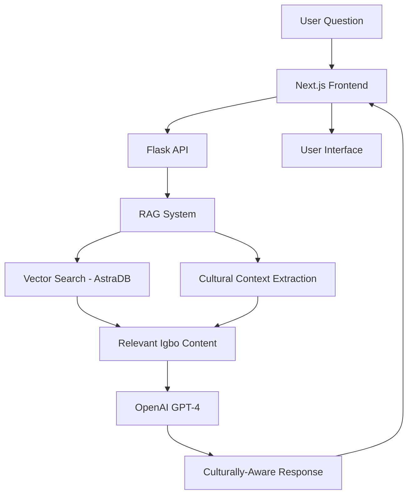

# 🌍 Achalugo AI - Igbo Cultural RAG System

<p align="center">
  
  <h3 align="center">Achalugo AI – Your Intelligent Igbo Cultural Companion</h3>
</p>

<p align="center">
  <strong>A sophisticated RAG (Retrieval-Augmented Generation) system that preserves and shares Igbo wisdom, proverbs, traditions, and cultural knowledge through conversational AI.</strong>
</p>

<p align="center">
  <a href="#-features">Features</a> •
  <a href="#-demo">Demo</a> •
  <a href="#-quick-start">Quick Start</a> •
  <a href="#-architecture">Architecture</a> •
  <a href="#-api-documentation">API</a> •
  <a href="#-contributing">Contributing</a>
</p>

---

## 🧠 What is Achalugo AI?

**Achalugo** (meaning "May God's will be done" in Igbo) is an intelligent cultural preservation system that combines modern AI technology with ancient Igbo wisdom. It serves as a digital elder—a warm, knowledgeable companion that can answer questions about Igbo language, proverbs, traditions, customs, and cultural practices.

### 🎯 Mission
- **Preserve** Igbo cultural knowledge for future generations
- **Make** traditional wisdom accessible to the diaspora
- **Bridge** the gap between elders and younger generations
- **Promote** Igbo language and cultural understanding globally

---

## ✨ Features

### 🏛️ Cultural Knowledge Base
- **5,000+ Igbo Proverbs** with English translations and meanings
- **Traditional Stories** and folktales with cultural context
- **Language Learning** support with pronunciation guides
- **Cultural Practices** explanations for ceremonies and traditions
- **Historical Context** for Igbo customs and beliefs

### 🤖 Intelligent Conversations
- **RAG-Powered Responses** using vectorized Igbo cultural content
- **Contextual Understanding** of cultural nuances and meanings
- **Multi-language Support** (Igbo, English, and mixed conversations)
- **Personalized Interactions** that adapt to user's cultural knowledge level
- **Smart Categorization** of content by themes (wisdom, family, spirituality, etc.)

### 🔍 Advanced Search & Discovery
- **Semantic Search** through Igbo proverbs and wisdom
- **Cultural Topic Exploration** with guided conversations
- **Proverb Recommendations** based on life situations
- **Historical Context** for cultural practices and beliefs

---

## 🎬 Demo

**Live Demo:** [https://igbo-culture-rag-py.vercel.app](https://igbo-culture-rag-py.vercel.app)

### Sample Conversations:
```
User: "Tell me about Igbo proverbs on family"
Achalugo: "Nwa bu ugwu nne ya - A child is the pride of their mother. 
This proverb emphasizes how children bring honor and joy to their parents..."

User: "What does 'chi' mean in Igbo culture?"
Achalugo: "Chi is a fundamental concept in Igbo spirituality representing 
one's personal god or guiding spirit. It's believed that everyone has a chi..."
```

---

## 🚀 Quick Start

### Prerequisites
- **Node.js** 18+ and npm/yarn
- **Python** 3.8+ with pip
- **OpenAI API Key** for embeddings and chat
- **AstraDB Account** for vector storage

### 1. Clone & Install
```bash
git clone https://github.com/Dprof-in-tech/igbo_culture_RAG.py.git
cd igbo_culture_RAG.py

# Install frontend dependencies
npm install

# Install Python dependencies
pip install -r requirements.txt
```

### 2. Environment Setup
```bash
cp .env.example .env
```

Fill in your environment variables:
```env
# OpenAI Configuration
OPENAI_API_KEY=your_openai_api_key

# AstraDB Vector Database
ASTRA_DB_APPLICATION_TOKEN=your_astra_token
ASTRA_DB_API_ENDPOINT=your_astra_endpoint
ASTRA_DB_KEYSPACE_NAME=your_keyspace
ASTRA_DB_COLLECTION_NAME=igbo_wisdom
```

### 3. Initialize Knowledge Base
```bash
# Scrape and vectorize Igbo cultural content
python api/integrate.py #only do this if you are running this RAG locally

# This will populate your vector database with:
# - Igbo proverbs and meanings
# - Cultural stories and traditions
# - Language learning content
# - Historical and spiritual knowledge
```

### 4. Start Development Servers
```bash


# Start Next.js frontend and Python backend
npm run dev
# Runs on http://localhost:3000
```

### 5. Start Chatting! 🗣️
Open [http://localhost:3000](http://localhost:3000) and start exploring Igbo culture with Achalugo!

---

## 🏗️ Architecture

### Tech Stack
- **Frontend:** Next.js 14, TypeScript, Tailwind CSS
- **Backend:** Flask (Python), RESTful API
- **AI/ML:** OpenAI GPT-4, Text Embeddings
- **Vector Database:** AstraDB with semantic search
- **Deployment:** Vercel (Frontend + Serverless Functions)

### System Flow


### RAG Pipeline
1. **Query Processing:** Extract cultural context and intent
2. **Vector Search:** Find relevant Igbo proverbs, stories, traditions
3. **Context Assembly:** Organize cultural knowledge by relevance
4. **Response Generation:** Generate culturally-aware, respectful responses
5. **Cultural Validation:** Ensure accuracy and cultural sensitivity

---

## 🔌 API Documentation

### Chat Endpoints

#### `POST /api/chat`
Send a message to Achalugo and get a culturally-informed response.

**Request:**
```json
{
  "message": "Tell me about Igbo naming traditions",
  "context": {
    "user_id": "optional_user_id",
    "conversation_id": "optional_conversation_id"
  }
}
```

**Response:**
```json
{
  "response": "In Igbo culture, names carry deep meaning and spiritual significance...",
  "cultural_context": [
    {
      "type": "tradition",
      "title": "Igbo Naming Ceremonies",
      "relevance": 0.95
    }
  ],
  "proverbs": [
    {
      "igbo": "Aha onye na-eme ya",
      "english": "One's name makes them who they are",
      "context": "naming_significance"
    }
  ],
  "conversation_id": "conv_123456789"
}
```

---

## 🗄️ Knowledge Base

### Content Sources
- **Traditional Igbo Proverbs** from cultural websites and books
- **Folklore and Stories** from Igbo oral tradition
- **Cultural Practices** documentation from anthropological sources
- **Language Resources** from Igbo language learning materials
- **Historical Records** from academic and cultural institutions


### Vector Database Schema
```python
{
  "igbo_text": "Original Igbo content",
  "english_meaning": "English translation/explanation",
  "categories": ["wisdom", "family", "spiritual"],
  "cultural_context": "Deep cultural significance",
  "source": "Attribution information",
  "verified": true,
  "embedding": [vector_representation]
}
```

---

## 🚀 Deployment

### Deploy to Vercel (Recommended)
[](https://vercel.com/new/clone?demo-title=Achalugo%20AI&demo-description=Igbo%20Cultural%20RAG%20System&demo-url=https%3A%2F%2Fachalugo-ai.vercel.app&project-name=achalugo-ai&repository-name=achalugo-ai)

### Manual Deployment
```bash
# Build the application
npm run build

# Deploy to Vercel
npx vercel --prod

# Set environment variables in Vercel dashboard
# Add your OpenAI API key and AstraDB credentials
```

### Production Configuration
- Set up monitoring for API usage and performance
- Configure rate limiting for API endpoints
- Enable logging for cultural content interactions
- Set up backup strategies for the knowledge base

---


## 🛡️ Privacy & Cultural Ethics

### Data Protection
- **User Privacy:** No personal cultural conversations are stored permanently
- **Cultural Sensitivity:** Respect for sacred and private cultural elements
- **Community Consent:** Traditional knowledge shared with community approval

### Cultural Respect
- **Sacred Content:** Certain traditional knowledge requires special handling
- **Elder Approval:** Major cultural additions reviewed by community elders
- **Inclusive Representation:** Fair representation of all Igbo communities


---

## 📄 License

This project is licensed under the MIT License - see the [LICENSE](LICENSE) file for details.

**Cultural Content:** Traditional Igbo knowledge is shared with respect and attribution to its community origins. All cultural content remains the intellectual property of the Igbo people and their cultural heritage.


---

<p align="center">
  <strong>Achalugo AI - Bridging Ancient Wisdom with Modern Technology</strong><br>
  <em>Preserving Igbo culture for future generations through intelligent conversation</em>
</p>

<p align="center">
  Made with ❤️ for the Igbo community and cultural preservation worldwide
</p>